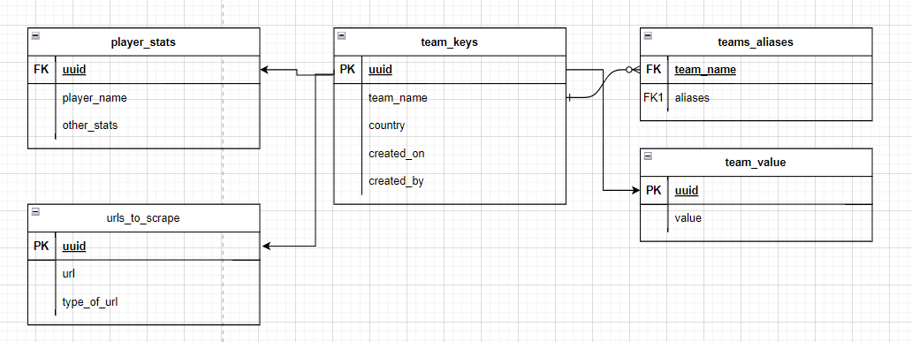

# **football_db**
A pipeline built to scrape Brazil and Argentina league's results and stats and serve them into a dashboard.

# **Summary**
- Heroku hosted (and scheduled)
- Scrapes **Transfermarkt** daily
- Loads data to **Data Lake**
- Inserts into database with constraints and QCs
- Version controlled database for security
- API built on Go for dashboard

# **Architechture and System Design**

## **Scraping**
Used BeautifulSoup4 (bs4) for this. 
No need for IP rotation as time between request was quite spaced. 
Kept the scraping and the transformation of the data within a single script with the URLs being abstracted.

## **Data Lake**
Using Google's Cloud Storage (GCS) in union with Google Big Query (GBQ). This way the data is always queryable (when necessary) by date, although
we mostly used the actual CS as a source for the data to be transformed in SQL.

## **Data Model of Database**
The database of choice was Postgres ran in Google Cloud Platform (GCP). We chose the cheapest tier for obvious reasons.
Our Data Model is shown above:

The database is 3NF as can be seen by the diagram.
